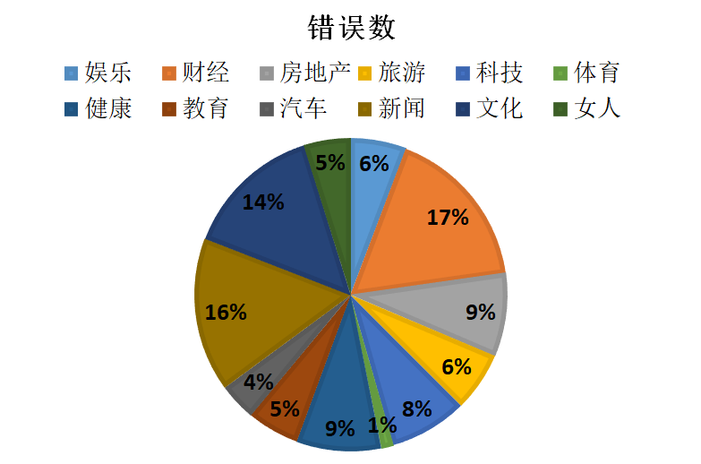

# News_Classification

[](https://pytorch.org/)[](https://www.python.org/)

#### 介绍
#### 新闻资讯文本分类

基于pytorch实现的 TextCNN 模型，模型已训练好，可直接使用


#### 环境

python 3.6

pytorch 1.8.1

jieba 0.42.1

gensim 4.0.1


#### 数据集

分类包括：娱乐, 财经, 房地产, 旅游, 科技, 体育, 健康, 教育, 汽车, 新闻, 文化, 女人共12类

我所使用的是搜狐新闻语料集，训练集有23549条新闻，测试集则有12000条。

各分类数量均匀，无明显差异

src/data/data.7z 解压即可得到我的原始数据


#### 数据预处理

1.将原始新闻文本文件按行打乱

2.使用jieba对所有新闻正文内容进行分词，得到词库

3.使用word2vec训练词库生成词向量模型

4.将原始新闻文本进行分词后，替换为词向量模型中的索引

分类,正文 -----> (分类id, [2,3,4,..词索引])


#### TextCNN模型示意图


#### 测试结果

对12000条新闻测试集进行测试

最终平均准确率为 **87.550%**

每个分类的错误数：

娱乐: 86	  财经: 254	房地产: 129	旅游: 92

科技: 120    体育: 19      健康: 131        教育: 81

汽车: 58      新闻: 238    文化: 214        女人: 72





#### 使用说明

安装好所需运行环境，拉取项目后

先将 src/model_save/model.7z 解压在当前文件夹中,这是训练好的模型

同样解压 src/data/word_vector/word_vector.7z，词向量数据

```shell
$ git clone git@gitee.com:worldcreator/News_Classification.gi

$ cd News_Classification

$ python main.py
```

将所需要分类的新闻正文文本复制到content.txt中, 执行main.py查看输出


#### 项目结构

```
NEWS_CLASSIFICATION
|   content.txt  #预测文本内容
|   main.py      #预测content.txt中的分类
|   
\---src
    |   data_loader.py        #为模型训练和测试提供取样本函数,取的是dara/Samples下的样本集
    |   data_peprocessing.py  #对 data/train_test_data.7z中的训练、测试数据进行预处理，弄完就没啥用了
    |   jieba_tool.py		  #对jieba分词封装
    |   model.py			  #TextCNN 模型的定义
    |   model_test.py		  #测试模型
    |   model_train.py		  #训练模型
    |   word_vector_tool.py   #word2vec词向量工具封装
    |   
    +---data
    |   |   data.7z #原始样本
    |   |   
    |   +---testSamples
    |   |       sample-0.pth  #预处理后的样本
	|	|		...........
    |   |       sample-119.pth
    |   |       
    |   +---trainSamples
	|   |       sample-0.pth
	|	|		...........
    |   |       sample-235.pth
    |   |       
    |   \---word_vector
    |           all_words.txt 		#词库
    |           cn_stopwords.txt 	#停用词
    |           words_vector.model	#word2vec词向量模型
    |           words_vector.model.syn1neg.npy
    |           words_vector.model.wv.vectors.npy
    |           
    +---model_save
    |       epoch.pth #已训练轮数
    |       model.pth #TextCNN模型
    |       
```


#### 参考论文

[1] Convolutional Neural Networks for Sentence Classification