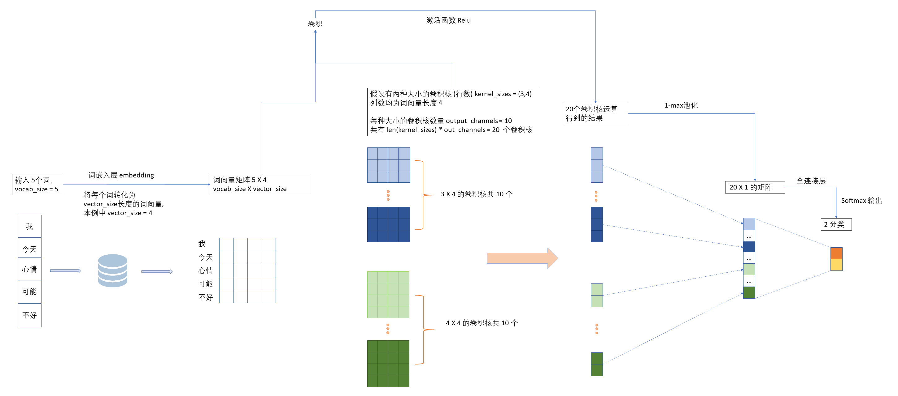

# News_Classification

<a href='www.baidu.com'></a> 

[](https://www.baidu.com/)

#### 介绍
新闻资讯文本分类

基于pytorch实现的 TextCNN 模型


#### TextCNN模型示意图




#### 安装教程

```shell
$ pip3 install torch==1.8.1+cu102 torchvision==0.9.1+cu102 torchaudio===0.8.1 -f https://download.pytorch.org/whl/torch_stable.html

$ pip install jieba

$ pip install gensim
```


#### 使用说明

```shell
$ git clone git@gitee.com:worldcreator/News_Classification.git

#先手动解压 src/model_save/model.7z -> src/model_save/model.pth 
# 还要解压 src/data/word_vector.7z
$ cd News_Classification

$ python main.py
```

将所需要分类的新闻正文文本复制到content.txt中, 执行main.py查看输出


#### 项目结构

```
NEWS_CLASSIFICATION
|   content.txt  #预测文本内容
|   main.py      #预测content.txt中的分类, python main.py
|   
\---src
    |   data_loader.py        #为模型训练和测试提供取样本函数,取的是dara/Samples下的样本集
    |   data_peprocessing.py  #对 data/train_test_data.7z中的训练、测试数据进行预处理，弄完就没啥用了
    |   jieba_tool.py		  #对jieba分词封装
    |   model.py			  #TextCNN 模型的定义
    |   model_test.py		  #测试模型
    |   model_train.py		  #训练模型
    |   word_vector_tool.py   #word2vec词向量工具封装
    |   
    +---data
    |   |   train_test_data.7z #原始样本
    |   |   
    |   +---testSamples
    |   |       sample-0.pth  #预处理后的样本
	|	|		...........
    |   |       sample-119.pth
    |   |       
    |   +---trainSamples
	|   |       sample-0.pth
	|	|		...........
    |   |       sample-235.pth
    |   |       
    |   \---word_vector
    |           all_words.txt 		#词库
    |           cn_stopwords.txt 	#停用词
    |           words_vector.model	#word2vec词向量模型
    |           words_vector.model.syn1neg.npy
    |           words_vector.model.wv.vectors.npy
    |           
    +---model_save
    |       epoch.pth 
    |       model.7z(model.pth) #整个TextCNN模型的存储
    |       
```